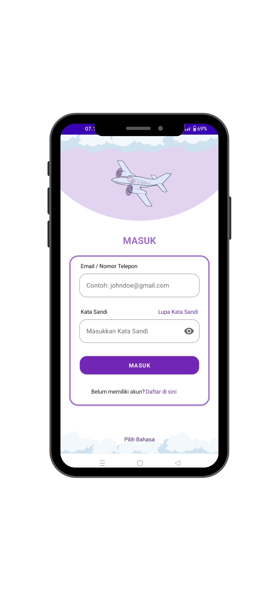
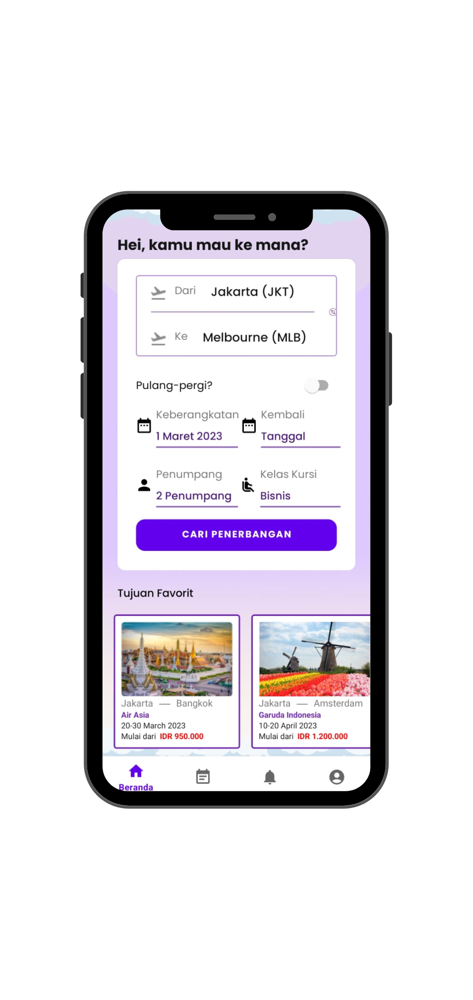

<h1 align="center"><strong>TerbangIn</strong></h1>
<h3 align="center"><strong>Aplikasi Pemesanan Tiket Pesawat</strong></h3>
<h3 align="center"><strong>Merupakan sebuah platform pemesanan tiket secara online berbasis android</strong></h3>

   

### Sneak Peek Our App 

   
   
   

# Link Presentasi
- https://www.canva.com/design/DAFnkrbyhTE/MaifjX9sE0r6g62_rpwLfw/view?utm_content=DAFnkrbyhTE&utm_campaign=designshare&utm_medium=link&utm_source=publishsharelink

# Link API Documentation
- https://docs.google.com/document/d/16cJ9IPdzRls-rnBk0UIYBVhZLjO044r0Y4yurcBqb40/edit?usp=sharing

# Link Deploy APK
- https://github.com/TerbangIn/AND-Tiketku

# Android C8 [AND-1] nama anggota :
1. Dheva Dayat Vito Indrajaka - Product Owner
2. Sekar Risma Aisyah
3. Rio Griya Putra

  
# Fitur - Fitur yang sudah dikerjakan 
1. Authentikasi
   - Login
   - Register
   - Forgot Password
   - Verification OTP
   - Update Profile
   - Log out
   
2. Order
   - Pencarian penerbangan ( Termasuk Filter pencarian penerbangan )
   - Detail Penerbangan
   - Pengisian biodata Pemesan dan Penumpang
   - Check Out
   - Payment
   - Cetak tiket ( Cetak tiket mengirim ke email )
   
3. Riwayat
   - Riwayat Penerbangan
   - Detail Riwayat Penerbangan
     
4. Notification
   - Mark all read

5. Akun
   - Menampilkan Profil
   - Update Profil

# Tech Stack

1. Bahasa Pemrograman Kotlin
2. IDEA Android Studio 
3. UI code using XML 
4. Android SDK 
5. Data Store
6. Gradle 
7. Firebase Crashlytics
8. Restful API Using Retrofit2, OkHttp3, Gson
9. Hilt Dagger
10. Navigation Component

